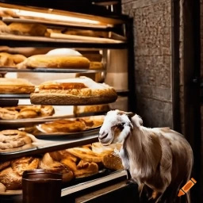
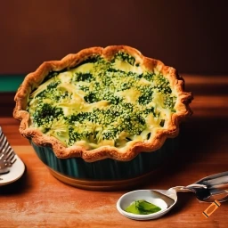

# Practicing Git on a team.

## This is a section about Goats

- Some goats are GRUMPY!
    - This is due to their lack of flight.
    - They reeeally want to fly for some reason.
- Some goats are able to fly!
- Some goats are very happy to bake you a pie!

### Mechanisms for goat flight:

)

- Jet packs
- Super Jet Packs
- springs
- wings
- dragonfly armies

#### Levitation $4,965.22

- Check out our new eco-friendly levitation solution!
- Your goat will gently hover with no need for dinosaur juices.

#### JetPack NG $925,332,576 - GREAT VALUE!!

- JetPack NG produces goat flight faster than you'd ever think possible!
- Is speed your goal?  JetPack NG is your solution.
    Please subscribe to your JetPack NG++ plan for continued flight - now only 7K/month.

### If a Goat is your friend, you are a lucky person!

If you are lucky enough to have a Goat for a friend, they may bake oyu a pie! Make sure to provide your goat friend with plenty of raw ingredients, and the fresher, the better!

)

Goats like to cook with:

- Blueberries
- Apples
- Broccoli

#### If a Goat bakes you a Broccoli pie...

)

You should feel extremely honored. Do you like Broccoli? No? DO NOT LET THEM KNOW THIS. Goats LOVE Broccoli, and to reject a Broccoli pie would insult them heavily! If you like Broccoli, then you are in good luck! If you do not... accept the pie, and then feed it to another Goat, who will see this as a great honor from you.

### Goats are also very fashionable.

Something something fashion.
